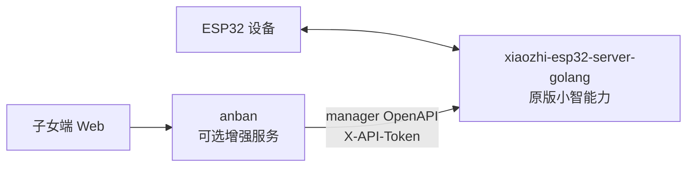

# 方案 C 仓库边界与部署总纲

> 日期：2026-06-15
> 目的：回答三个问题：现在处于什么阶段；设备到手后按方案 C 怎么部署；`anban-code` 这个仓库到底是什么。
> 权威背景：完整设计文档以 `AnBan-docs-repo` 为准；本文件是本代码仓里的执行入口，细节继续跳转到本仓 `docs/specs/`、`docs/plans/` 和 `docs/deployment/`。

## 0. 先给结论

现在不要继续往“大产品”扩。当前阶段要回到 PRD V0.1 路演主线：先保证原版小智语音链路独立可用，再把安伴作为可插拔增强服务接上去，把状态、留言、主动问候、提醒、画像这些基本闭环跑稳。

方案 C 的关键不是“本仓要替代 xiaozhi”，而是：

1. `xiaozhi-esp32-server-golang` 是冻结上游，负责设备连接、原版语音对话、打断、ASR/LLM/TTS、manager 控制面。
2. `anban` 是本仓编译出来的安伴增强服务，负责子女端、留言、问候、提醒、画像、状态、视觉触发等安伴产品能力。
3. 只部署 `xiaozhi-esp32-server-golang` 时，设备也必须能正常对话。
4. 再部署 `anban` 后，设备才获得“安伴”能力；停掉 `anban` 不应破坏原版小智对话。

一句话：**xiaozhi 是底座，anban 是可选增强层；两者通过 manager OpenAPI 连接。**

## 1. 三个仓库怎么摆

建议并排放，不互相嵌套：

```text
D:\Program\Project\
  AnBan-docs-repo\                 # 权威文档仓：PRD、架构、计划、历史背景
  xiaozhi-esp32-server-golang\     # 冻结上游：设备原版语音闭环
  anban-code\                      # 本仓：安伴后端 + 子女端 Web
```

本仓 `anban-code` 是：

- 安伴 Go 后端：`server/cmd/anban`
- 安伴预检工具：`server/cmd/anban-preflight`
- 子女端静态 Web：`web/`
- 编码用文档工作副本：`docs/`

本仓不是：

- xiaozhi fork
- 设备固件仓
- ASR/LLM/TTS 云服务实现
- 完整文档仓
- 原版小智对话能力的必需组件

## 2. 两进程拓扑

方案 C 在部署视角是两个服务：



两条链路要分开看：

```text
原版小智链路：
设备 <-> xiaozhi-esp32-server-golang <-> 云 ASR/LLM/TTS

安伴增强链路：
子女端 Web -> anban -> xiaozhi manager OpenAPI -> xiaozhi core -> 设备
```

这带来一个非常重要的验收口径：**安伴坏了，原版小智仍应能说话；xiaozhi 没跑通，安伴不应该继续堆功能。**

## 3. 职责边界

| 事项 | xiaozhi-esp32-server-golang | anban-code |
|---|---|---|
| 设备连接 | 拥有 | 不拥有 |
| 原版语音对话 | 拥有 | 不拥有 |
| ASR/LLM/TTS 编排 | 拥有 | 不拥有 |
| 打断、连续对话 | 拥有 | 不拥有 |
| manager OpenAPI | 暴露 | 调用 |
| 子女端访问码 | 不管 | 拥有 |
| 留言、问候、提醒 | 不理解业务含义 | 拥有业务编排 |
| 家庭画像 | 存在于安伴业务 | 可同步到 xiaozhi prompt |
| 设备在线/历史 | xiaozhi 是真相源 | 只读聚合给子女端 |
| 安伴 DB | 不管 | 保存留言、提醒、画像、状态缓存 |

编码铁律：

- 所有 xiaozhi 调用只能经过 `server/internal/xiaozhiclient`。
- `childapi` 只调 `domains`，不直接碰 xiaozhi 或数据库。
- `domains` 之间不互相 import。
- 不把 xiaozhi 代码拉进本仓，不在本仓修 xiaozhi 上游。

## 4. 设备到手后的部署顺序

### Gate A：只跑 xiaozhi

先在 `xiaozhi-esp32-server-golang` 仓库部署上游服务。此时不要启动 `anban`。

必须看到：

- 设备能连上 xiaozhi。
- 设备能完成一次“唤醒 -> 说话 -> 听到回复”。
- 原版打断或连续对话符合上游预期。
- 这一步完全不依赖 `anban-code`。

如果 Gate A 不过，停在硬件、固件、网络、云 API、xiaozhi 配置上排查，不进入安伴业务联调。

### Gate B：签 manager token，并让 anban 预检通过

在 xiaozhi manager 签发 OpenAPI token。安伴只需要：

```text
ANBAN_MANAGER_BASE_URL=http://localhost:8080
ANBAN_MANAGER_API_TOKEN=<manager 签发的 token>
```

回到 `anban-code`：

```powershell
Copy-Item .env.example .env
```

填 `.env`：

```text
ANBAN_MANAGER_BASE_URL=http://localhost:8080
ANBAN_MANAGER_API_TOKEN=<manager 签发的 token>
ANBAN_ACCESS_CODE=demo
ANBAN_DB_DSN=anban.db
ANBAN_LISTEN_ADDR=:8090
ANBAN_ALLOWED_ORIGINS=http://127.0.0.1:5173,http://localhost:5173
```

跑预检：

```powershell
Set-Location server
$env:GOPROXY="https://goproxy.cn,direct"; $env:GOSUMDB="off"; $env:CGO_ENABLED="0"
$env:ANBAN_MANAGER_BASE_URL="http://localhost:8080"
$env:ANBAN_MANAGER_API_TOKEN="<manager 签发的 token>"
$env:ANBAN_ACCESS_CODE="demo"

go run ./cmd/anban-preflight -device-id <xiaozhi设备ID>
```

确认纯 xiaozhi 已人工通过后，再跑：

```powershell
go run ./cmd/anban-preflight -device-id <xiaozhi设备ID> --xiaozhi-gate-passed
```

Gate B 必须看到：

- manager URL 可达。
- token 被接受。
- 指定设备 ID 能在 manager 侧查到，状态符合预期。

### Gate C：启动 anban 和子女端 Web

启动安伴后端：

```powershell
Set-Location server
$env:GOPROXY="https://goproxy.cn,direct"; $env:GOSUMDB="off"; $env:CGO_ENABLED="0"
$env:ANBAN_MANAGER_BASE_URL="http://localhost:8080"
$env:ANBAN_MANAGER_API_TOKEN="<manager 签发的 token>"
$env:ANBAN_ACCESS_CODE="demo"

go run ./cmd/anban
```

健康检查：

```powershell
Invoke-RestMethod http://localhost:8090/health
```

启动子女端：

```powershell
Set-Location web
python -m http.server 5173
```

浏览器打开：

```text
http://127.0.0.1:5173/
```

页面填写：

```text
后端地址：http://localhost:8090
访问码：ANBAN_ACCESS_CODE 的值
设备 ID：Gate A 记录的 xiaozhi 设备 ID
```

Gate C 联调顺序：

1. 状态页能显示在线、离线或最近互动。
2. 子女端发留言，设备能播报。
3. 子女端触发问候，设备能开口。
4. 创建一条短时间提醒，到点能播报。
5. 画像能保存，并同步到 xiaozhi role/prompt。
6. 视觉能力最后接，必要时降级，不阻塞前面基础链路。

### Gate D：验证可插拔

停止 `anban`，保留 xiaozhi。

必须看到：

- 子女端增强能力不可用，这是正常的。
- 设备原版小智对话仍然可用。
- 重启 `anban` 后，子女端增强能力恢复。

如果停掉 `anban` 后设备也不能对话，说明方案 C 边界被破坏，先修架构边界，不继续写功能。

## 5. 当前服务器部署口径

截至 2026-06-14 的真机联调口径：

```text
服务器：101.34.214.149
xiaozhi manager：http://101.34.214.149:8080
xiaozhi WS/OTA：101.34.214.149:8989
anban：http://101.34.214.149:8090
子女端 Web：http://101.34.214.149:8091
已验证设备 ID：9c:13:9e:8b:af:28
```

真实部署方式是交叉编译二进制、上传、重启：

```powershell
bash deploy.sh
```

`deploy.sh` 只部署本仓的 `anban` 二进制。它默认：

- 本地交叉编译 `server/cmd/anban` 为 linux/amd64。
- 上传到服务器 `/home/ubuntu/anban/anban.new`。
- 服务器执行 `~/anban/start.sh`。
- 敏感配置在服务器 `~/anban/anban.env`，不入库。

注意：这不是 `git pull` 到服务器再 build。改完代码只有重新部署后，线上才会生效。

## 6. 真实设备联调坑位

已知真机事实：

- `auth.enable=false` 时，设备不会自动注册进 manager 设备表；OpenAPI 又要求设备在表里且归属当前用户。换新设备时可能需要在 manager 侧登记设备。
- 设备 MCP 工具是固件自带能力，例如 `self.camera.take_photo`、`self.audio_speaker.set_volume` 等。视觉链路优先通过 MCP 调用，不要先改 xiaozhi core。
- 豆包链路已经验证更适合当前设备工具调用。不要轻易切 DeepSeek/OpenAI，它们可能处理不了带点号的 `self.*` 工具名。
- 保活问题属于设备或固件侧。设备一闲就断 WS 时，不要在 anban 代码里硬修。

## 7. 拉文档和依赖的代理口径

如果本机拉 GitHub 或依赖需要代理，只在当前 shell 会话设置：

```powershell
$env:HTTP_PROXY="http://127.0.0.1:7890"
$env:HTTPS_PROXY="http://127.0.0.1:7890"
```

不要把代理、token、API key 写进仓库文件。

Go 依赖在国内环境按本仓纪律设置：

```powershell
$env:GOPROXY="https://goproxy.cn,direct"
$env:GOSUMDB="off"
$env:CGO_ENABLED="0"
```

## 8. 当前阶段怎么判断有没有完成

“基础框架和基本功能”不是看代码目录是否齐了，而是看四个 Gate：

| Gate | 完成才算什么成立 |
|---|---|
| A 纯 xiaozhi | 原版设备语音底座成立 |
| B manager 接入 | anban 能安全驱动 xiaozhi |
| C 子女端闭环 | 安伴最小产品链路成立 |
| D 可插拔 | 方案 C 架构边界成立 |

软件侧已经有地基：Go 后端、子女端 Web、预检工具、`xiaozhiclient` 和主要业务域。但阶段完成要以真机 Gate A/B/C/D 为准。

当前优先级：

1. 不回头做大产品框架。
2. 不改 xiaozhi 上游。
3. 不在 Gate A 不稳时堆安伴业务。
4. 优先 PRD 必演：被动语音、主动开口、子女留言、状态、画像、提醒。
5. 视觉最后做，可降级。

## 9. 继续开发时看哪些文档

推荐阅读顺序：

1. `docs/现状与交接-2026-06-14.md` - 真机联调后的现实坑位。
2. `AGENTS.md` - 编码边界和依赖纪律。
3. `docs/安伴V0.1产品文档PRD.md` - 路演必演功能和验收标准。
4. `docs/specs/2026-05-28-server-architecture-design.md` - 方案 C 原始架构决策。
5. `docs/specs/2026-05-29-xiaozhi-full-architecture-map.md` - xiaozhi manager/OpenAPI 能力地图。
6. `docs/deployment/方案C部署与联调指南.md` - 长版部署细节。
7. `docs/deployment/设备到手方案C首日执行单.md` - 现场短清单。

完整背景仍以 `AnBan-docs-repo` 为准。本仓 `docs/` 是编码工作副本，只放最常用的几份。

