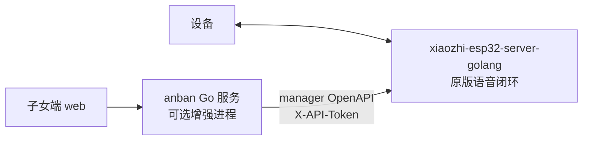

# 方案 C 部署与联调指南

> 适用场景：设备已经到手，需要按“xiaozhi 原版能力先跑通，安伴作为可选增强服务接入”的方案 C 做本地或路演 Demo 部署。
>
> 权威设计仍以完整文档仓 `AnBan-docs-repo` 为准。本文件是本代码仓里的执行版清单，用来避免部署时把仓库边界搞混。

## 0. 现场速查

拿到设备后的执行顺序固定为四步：

1. **只跑 xiaozhi**：先在 `xiaozhi-esp32-server-golang` 仓库部署上游服务，完成设备唤醒、回应、打断。此时不要启动 `anban`。
2. **签 manager token**：在 xiaozhi manager 里拿到 OpenAPI Token，记录设备 ID，确认 manager URL 能从运行 `anban` 的机器访问。
3. **启动 anban**：回到本仓库 `anban-code`，配置 `.env`，先跑 `server/cmd/anban-preflight`，再跑 `server/cmd/anban`。
4. **打开子女端 web**：本仓库 `web/` 用静态 HTTP 服务打开，填后端地址、访问码、设备 ID，按状态 -> 留言 -> 问候 -> 提醒的顺序联调。

最短命令清单：

```powershell
# 1) 安伴仓库：复制配置
Copy-Item .env.example .env

# 2) 安伴后端：预检 manager/token/设备状态
Set-Location server
$env:GOPROXY="https://goproxy.cn,direct"; $env:GOSUMDB="off"; $env:CGO_ENABLED="0"
$env:ANBAN_MANAGER_BASE_URL="http://localhost:8080"
$env:ANBAN_MANAGER_API_TOKEN="<manager 签发的 token>"
go run ./cmd/anban-preflight -device-id <xiaozhi设备ID>

# 3) 人工确认纯 xiaozhi 已通过后，再允许预检整体通过
go run ./cmd/anban-preflight -device-id <xiaozhi设备ID> --xiaozhi-gate-passed

# 4) 启动 anban
$env:ANBAN_ACCESS_CODE="demo"
go run ./cmd/anban
```

另开一个 PowerShell 启动子女端：

```powershell
Set-Location web
python -m http.server 5173
```

浏览器打开：

```text
http://127.0.0.1:5173/
```

联调时只看这四个 Gate：

| Gate | 必须看到什么 | 没过时怎么处理 |
|---|---|---|
| A 纯 xiaozhi | 设备不依赖安伴也能唤醒、回应、打断 | 先停在 xiaozhi/硬件/网络/云 API 排查，不继续堆安伴功能 |
| B manager 接入 | `anban-preflight` 能访问 manager OpenAPI，token 被接受，且指定设备在线 | 查 `ANBAN_MANAGER_BASE_URL`、`ANBAN_MANAGER_API_TOKEN`、设备 ID、端口、防火墙 |
| C 子女端闭环 | web 能连 anban，状态/留言/问候/提醒最小链路可用 | 查 `ANBAN_ACCESS_CODE`、CORS、设备 ID、anban 日志 |
| D 可插拔 | 停掉 `anban` 后，设备仍能继续原版小智对话 | 若失败，说明边界被破坏，必须回到方案 C 架构检查 |

## 1. 一句话架构

方案 C 不是把 xiaozhi 改造成安伴，也不是把 xiaozhi 代码搬进本仓库。它是两个进程：

1. `xiaozhi-esp32-server-golang`：冻结上游，负责设备连接、语音链路、ASR、LLM、TTS、原版小智对话。
2. `anban`：本仓库的 Go 服务，负责子女端 API、留言、问候、提醒、画像、状态、视觉等安伴产品能力。

数据与命令方向固定为：

```text
子女端 web -> anban -> xiaozhi manager OpenAPI -> xiaozhi core -> 设备
```

设备的原版语音闭环固定为：

```text
设备 <-> xiaozhi-esp32-server-golang <-> 云端 ASR/LLM/TTS
```

如果只部署 `xiaozhi-esp32-server-golang`，设备也必须能正常对话。再部署 `anban` 后，才增加安伴的子女端留言、主动问候、提醒、画像和状态页能力。



## 2. 这个仓库是什么

本仓库 `anban-code` 是安伴代码仓：

- `server/`：安伴 Go 后端，启动入口是 `server/cmd/anban/main.go`。
- `web/`：子女端静态前端，调用 `anban` 的 `childapi`。
- `docs/`：编码常用文档工作副本，不是完整设计文档仓。
- `docker-compose.yml`：两进程联调的编排示例。里面的 `xiaozhi` 服务只是占位，镜像、构建、环境变量要按 xiaozhi 上游仓库文档填写。

本仓库不是：

- xiaozhi 服务端仓库。
- 设备固件仓库。
- ASR/LLM/TTS 实现仓库。
- 原版小智对话能力的必需组件。

仓库建议并排放，不要互相嵌套：

```text
D:\Program\Project\
  anban-code\
  AnBan-docs-repo\
  xiaozhi-esp32-server-golang\
```

## 3. 部署原则

1. 先跑通纯 xiaozhi，再接安伴。设备到手后的第一目标是证明“设备 -> xiaozhi -> 云端模型 -> 设备”完整闭环成立。
2. 停掉安伴，不应影响设备继续使用原版小智能力。
3. 安伴只通过 `internal/xiaozhiclient` 调用 xiaozhi manager OpenAPI，鉴权头是 `X-API-Token`。
4. 安伴数据库只保存安伴自己的业务数据，例如留言、问候、提醒、画像、状态缓存。xiaozhi 的设备、会话、角色等数据仍归 xiaozhi 管。
5. 不把 manager token、访问码、云服务 key 提交到 Git。只放 `.env` 或本机环境变量。

## 4. 当前阶段范围

当前不是做“大产品”，而是按 PRD 和三周计划先拿到可演示、可回退的最小闭环。优先级如下：

1. Gate A：纯 xiaozhi 能唤醒、回应、打断，且不依赖安伴。
2. Gate B：安伴能用 manager OpenAPI/token 访问 xiaozhi。
3. Gate C：子女端最小闭环可用，包括状态、留言、主动问候和提醒。
4. 画像只做到能保存并注入角色 prompt，先服务“能被问到家人信息”的演示点。
5. 视觉能力可以最后接，必要时允许降级，不阻塞前面三个 Gate。

当前阶段暂不展开：

- 复杂运营后台、多租户、权限体系、计费或完整用户系统。
- 大规模数据分析、长期健康趋势和完整风控体系。
- 改造 xiaozhi 内核、迁移 xiaozhi 数据库，或把 xiaozhi 代码并入本仓库。
- 为了视觉能力牺牲原版对话、留言、问候、提醒这些基础演示链路。

## 5. 阶段 0：硬件第一天准备

这一步不跑安伴。

准备：

- 确认开发板型号、固件版本、串口驱动、烧录工具。
- 使用真正支持数据传输的 USB-C 线。
- 确认设备能连 Wi-Fi，且能访问部署 xiaozhi 的机器或公网地址。
- 准备 xiaozhi 所需的 ASR/LLM/TTS 云服务配置。
- 从完整文档仓查对应硬件首日清单和 xiaozhi 部署说明。

如果本机拉 GitHub 需要代理，可以只在当前 PowerShell 会话里设置：

```powershell
$env:HTTP_PROXY="http://127.0.0.1:7890"
$env:HTTPS_PROXY="http://127.0.0.1:7890"
```

不要把代理、token 或 key 写死到仓库文件里。

## 6. 阶段 1：先部署 xiaozhi

在 `xiaozhi-esp32-server-golang` 仓库里按上游文档部署，不要把 xiaozhi 源码复制到 `anban-code`。

最小验收：

1. xiaozhi manager 能打开或健康检查正常。
2. 设备能在 xiaozhi manager 里看到在线状态，或者至少能稳定连接到 xiaozhi core。
3. 设备能完成一次原版小智对话：唤醒、说一句话、听到回复。
4. 打断、连续对话或自动聆听等原版能力按上游预期工作。
5. 记录设备 ID。安伴后续 API 会用它定位设备。

这一步没过，不进入安伴联调。否则会把硬件、固件、网络、云模型和安伴业务问题混在一起排查。

## 7. 阶段 2：签发 manager API Token

安伴通过 xiaozhi manager 的 `/api/open/v1/*` 接口驱动设备，需要 manager 签发的 API Token。

配置到安伴时用：

```text
ANBAN_MANAGER_BASE_URL=http://localhost:8080
ANBAN_MANAGER_API_TOKEN=<manager 签发的 token>
```

如果安伴和 xiaozhi 在同一个 `docker-compose` 网络里，`ANBAN_MANAGER_BASE_URL` 通常是：

```text
ANBAN_MANAGER_BASE_URL=http://xiaozhi:8080
```

如果安伴在宿主机直接运行，而 xiaozhi manager 暴露在宿主机 `8080`，则用：

```text
ANBAN_MANAGER_BASE_URL=http://localhost:8080
```

## 8. 阶段 3：启动安伴后端

在 `anban-code` 仓库根目录复制环境变量模板：

```powershell
Copy-Item .env.example .env
```

编辑 `.env`，至少填：

```text
ANBAN_MANAGER_BASE_URL=http://localhost:8080
ANBAN_MANAGER_API_TOKEN=<manager 签发的 token>
ANBAN_ACCESS_CODE=demo
ANBAN_DB_DSN=anban.db
ANBAN_LISTEN_ADDR=:8090
ANBAN_ALLOWED_ORIGINS=http://127.0.0.1:5173,http://localhost:5173
```

启动业务服务前，先跑一次安伴预检。它不会让设备播报，也不会改 xiaozhi，只做三件事：提示 Gate A 纯 xiaozhi 语音闭环必须人工先过；用 manager OpenAPI/token 做非侵入式访问检查；如果提供了设备 ID，再检查指定设备是否在线。

```powershell
Set-Location server
$env:ANBAN_MANAGER_BASE_URL="http://localhost:8080"
$env:ANBAN_MANAGER_API_TOKEN="<manager 签发的 token>"
$env:ANBAN_ACCESS_CODE="demo"
go run ./cmd/anban-preflight -device-id <xiaozhi设备ID>
```

预期输出形状：

```text
[MANUAL] xiaozhi-only voice loop - Gate A: 先在未依赖 anban 的情况下完成原版小智唤醒、回应、打断；此项不能由 anban 自动验证。
[PASS] xiaozhi manager OpenAPI access - manager OpenAPI 可访问，API Token 已被接受。
[PASS] xiaozhi manager device status - 设备 <xiaozhi设备ID> 在线; last_active_at=...
```

preflight 默认不会因为 manager/token 通过就退出 0。确认已经人工完成 Gate A 后，再加确认参数：

```powershell
go run ./cmd/anban-preflight -device-id <xiaozhi设备ID> --xiaozhi-gate-passed
```

也可以用环境变量：

```powershell
$env:ANBAN_PREFLIGHT_XIAOZHI_GATE_PASSED="true"
go run ./cmd/anban-preflight -device-id <xiaozhi设备ID>
```

如果暂时不知道设备 ID，只想先排查 manager URL/token，可以显式加 `--allow-missing-device-id`：

```powershell
go run ./cmd/anban-preflight --xiaozhi-gate-passed --allow-missing-device-id
```

这时 preflight 会检查 manager URL/token，并把具体设备在线检查显示为 `[SKIP]`。它只代表 manager-only 网络/token 检查通过，不代表真实设备接入已通过；设备到手联调时仍要补跑带 `-device-id <xiaozhi设备ID>` 的预检。

本地直接运行：

```powershell
Set-Location server
$env:GOPROXY="https://goproxy.cn,direct"; $env:GOSUMDB="off"; $env:CGO_ENABLED="0"
$env:ANBAN_MANAGER_BASE_URL="http://localhost:8080"
$env:ANBAN_MANAGER_API_TOKEN="<manager 签发的 token>"
$env:ANBAN_ACCESS_CODE="demo"
go run ./cmd/anban
```

健康检查：

```powershell
Invoke-RestMethod http://localhost:8090/health
```

预期返回：

```json
{"status":"ok"}
```

## 9. 阶段 4：打开子女端 Web

当前 `web/` 是静态页面，可以先用简单 HTTP 服务打开：

```powershell
Set-Location web
python -m http.server 5173
```

浏览器访问：

```text
http://127.0.0.1:5173/
```

页面里填：

- 后端地址：`http://localhost:8090`
- 访问码：`.env` 里的 `ANBAN_ACCESS_CODE`
- 设备 ID：阶段 1 记录的 xiaozhi 设备 ID

子女端请求安伴时使用 `X-Access-Code`；安伴请求 xiaozhi manager 时使用 `X-API-Token`。这两个鉴权不要混。

如果你把子女端静态页换到别的端口或域名，需要同步更新安伴后端的 `ANBAN_ALLOWED_ORIGINS`，否则浏览器会拦截跨域请求。

## 10. 最小联调顺序

按这个顺序排查最省时间：

1. 纯 xiaozhi 对话通过。设备不依赖安伴也能说话。
2. `go run ./cmd/anban-preflight -device-id <xiaozhi设备ID>` 输出 Gate A 手工项和 manager 设备在线检查结果。
3. 安伴 `/health` 通过。
4. 子女端能连上安伴，访问码正确。
5. 状态页能通过 `/api/device/status` 或 `/api/status` 读到设备状态。
6. 留言能调用 `POST /api/messages`，安伴通过 manager `POST /api/open/v1/devices/inject-message` 让设备播报。
7. 主动问候能调用 `POST /api/greetings/trigger`。
8. 提醒能创建、到点播报，并在子女端显示状态。
9. 画像能保存，并通过 manager agent API 写入角色 prompt。
10. 视觉能力最后联调。当前可以先走降级链路或 Fake/MCP raw presence，真实主动采帧能力按 xiaozhi manager/MCP 实际支持程度接入。

## 11. docker-compose 怎么用

本仓库的 `docker-compose.yml` 表达的是“两个进程一起跑”的目标形态：

- `xiaozhi`：占位服务。镜像、build、volume、env 都要按 xiaozhi 上游仓库文档补齐。
- `anban`：本仓库服务，从 `./server` 构建，通过 `ANBAN_MANAGER_BASE_URL` 指向 `xiaozhi`。

适合两种用法：

1. xiaozhi 已在宿主机跑：只直接运行 `server/cmd/anban`，不用 compose 里的 xiaozhi 占位。
2. xiaozhi 镜像已经准备好：补齐 compose 里的 xiaozhi 配置，再 `docker compose up` 同时拉起两进程。

关键点：`docker-compose.yml` 不是在声明本仓库拥有 xiaozhi 源码。它只是给联调时的进程拓扑留了位置。

## 12. 验收门

### Gate A：纯 xiaozhi

- 设备能连上 xiaozhi。
- 原版对话可用。
- 停止安伴不影响设备对话。

### Gate B：安伴接入 xiaozhi manager

- `ANBAN_MANAGER_BASE_URL` 可达。
- `ANBAN_MANAGER_API_TOKEN` 有效。
- 安伴能通过 manager OpenAPI 查设备或注入播报。

### Gate C：子女端最小闭环

- 子女端能通过访问码调用安伴。
- 留言能播报。
- 问候能播报。
- 状态能显示在线、离线或最近活跃时间。

### Gate D：可插拔性

- 停掉 `anban` 后，设备仍能继续原版小智对话。
- 重启 `anban` 后，子女端功能恢复，不要求改 xiaozhi 代码。

## 13. 常见错误

- 还没跑通纯 xiaozhi，就开始调安伴业务接口。
- 把 `docker-compose.yml` 里的 `xiaozhi` 占位误认为本仓库会构建 xiaozhi。
- 在业务域里直接发 HTTP 调 xiaozhi，而不是经过 `internal/xiaozhiclient`。
- 把 `X-Access-Code` 和 `X-API-Token` 混用。
- 使用设备名称、数据库自增 ID、设备 ID 时没有确认 manager 实际返回字段。
- 把 API Token 写进 README、测试脚本或提交记录。
- 视觉能力没准备好时阻塞整体演示。视觉可以降级，原版对话、留言、问候、提醒、画像优先。

## 14. 当前仓库下一步

设备到手后的执行顺序建议是：

1. 按 xiaozhi 上游文档完成纯 xiaozhi 部署和设备联调。
2. 签发 manager API Token。
3. 启动本仓库 `server/cmd/anban`。
4. 打开 `web/` 静态子女端，先联调状态、留言、问候。
5. 再补提醒、画像、视觉等演示链路。

不要在 Gate A 未通过前继续堆安伴大功能。方案 C 的核心价值就是可插拔：xiaozhi 先独立可用，安伴再作为增强接入。
