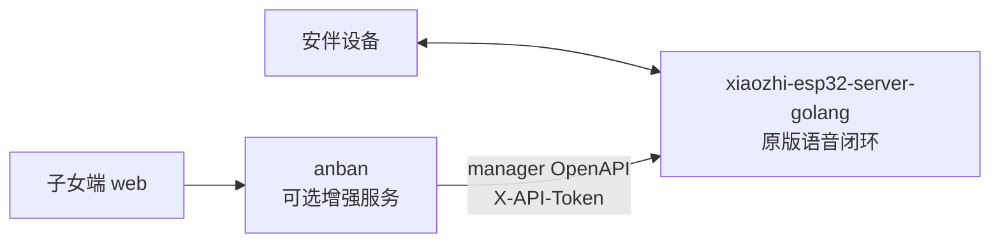

# 真机后阶段对齐与方案 C 部署说明

> 日期：2026-06-14
> 目的：回答“现在是什么阶段、之前基础目标算不算实现、设备到了以后按方案 C 怎么部署、这个仓库到底是什么”。
> 权威背景：完整设计文档以 `AnBan-docs-repo` 为准；本文件是 `anban-code` 里的当前执行版。

## 0. 结论先行

现在不是继续扩成“大产品”的阶段，而是回到 PRD V0.1 的路演 Demo 主线：先保证原版小智语音链路稳定，再把安伴作为可插拔增强服务接上去，把状态、留言、主动问候、提醒、画像这些基础闭环跑稳。

之前“先做最基础框架和基本功能”的目标，不能简单说“已经完成”或“没有完成”：

- 从代码侧看，`server/` 地基、`web/` 子女端、`xiaozhiclient`、预检工具和主要业务域已经搭起来了。
- 从产品侧看，只有真设备上通过 Gate A/B/C/D 后，才算这个阶段真正完成。
- 截至 2026-06-14，真机已经验证了老人语音对话，以及“子女网页发留言 -> 设备播报”的核心产品流；但保活、完整对话记录、PRD 验收口径打磨仍要继续收尾。

一句话定位：**软件骨架已具备，真机最小闭环已打通一部分；当前进入“按 PRD 补基础缺口 + 加固部署”的阶段。**

## 1. 方案 C 的核心

方案 C 是两个后端进程，而不是把 xiaozhi 改成本仓的一部分：

1. `xiaozhi-esp32-server-golang`
   - 冻结上游。
   - 负责设备连接、WebSocket/OTA、语音对话、ASR、LLM、TTS、打断、manager。
   - 只部署它时，设备也必须能正常完成原版小智对话。

2. `anban`
   - 本仓库 `server/cmd/anban` 编译出来的安伴服务。
   - 是可选增强进程。
   - 负责子女端 API、留言、问候、提醒、画像、状态、视觉触发等安伴产品能力。
   - 只能通过 xiaozhi manager OpenAPI 驱动设备，不能直接改 xiaozhi 核心。

固定数据方向：

```text
子女端 web -> anban -> xiaozhi manager OpenAPI -> xiaozhi core -> 设备
```

固定原版语音链路：

```text
设备 <-> xiaozhi-esp32-server-golang <-> 云端 ASR/LLM/TTS
```

可插拔性是本方案的底线：**停掉 `anban` 以后，设备仍应能继续原版小智对话；再启动 `anban`，才恢复安伴增强能力。**



## 2. 这个仓库是什么

`anban-code` 是安伴代码仓，包含：

- `server/`：Go 后端，启动入口是 `server/cmd/anban/main.go`。
- `server/internal/childapi/`：子女端 HTTP API 边界。
- `server/internal/domains/`：安伴业务域，包含 `message`、`greeting`、`reminder`、`profile`、`status`、`vision`。
- `server/internal/xiaozhiclient/`：唯一允许懂 xiaozhi manager OpenAPI 的适配层。
- `web/`：子女端静态 Web。
- `docs/`：编码常用文档工作副本，不是完整文档仓。
- `deploy.sh`：把 `anban` 交叉编译为 linux/amd64 二进制并部署到服务器的脚本。

它不是：

- `xiaozhi-esp32-server-golang` 仓库。
- 设备固件仓库。
- 云端 ASR/LLM/TTS 的实现仓库。
- 原版小智基础对话能力的必需组件。

推荐仓库并排放：

```text
D:\Program\Project\
  AnBan-docs-repo\
  xiaozhi-esp32-server-golang\
  anban-code\
```

## 3. 当前真机事实

截至 2026-06-14，已知真实部署事实如下：

- 服务器：`101.34.214.149`
- xiaozhi manager：`:8080`
- xiaozhi WS/OTA：`:8989`
- anban 后端：`:8090`
- 子女网页：`:8091`
- 当前测试设备 ID：`9c:13:9e:8b:af:28`
- AI 链路：豆包 ASR + 豆包 LLM + 豆包 TTS
- 已真机验证：老人语音对话；子女网页发留言后设备播报。

必须保留的经验结论：

- 设备一闲就断 WS、导致主动播报推不进去，这是固件/设备保活问题，不在 `anban` 里修。
- 留言是子女点对点必达消息，不走主动语音 10 分钟配额。
- LLM 继续用豆包；DeepSeek/OpenAI 对设备 `self.*` 带点工具名兼容性不好。
- `auth.enable=false` 时设备不会自动进 manager 设备表，OpenAPI 又要求设备在表里且属于当前用户；换设备时需要确认 manager 侧登记。
- 设备 MCP 工具来自固件，例如 `self.camera.take_photo`、`self.audio_speaker.set_volume`、`self.screen.set_theme`，不是 anban 自己发明的接口。

## 4. 现在怎么部署

### 4.1 只部署 xiaozhi

先在 `xiaozhi-esp32-server-golang` 仓库完成上游部署。此时不启动 `anban`。

Gate A 必须确认：

- 设备能连接 xiaozhi。
- 设备能完成“唤醒 -> 说话 -> 听到回复”。
- 打断或连续对话符合上游预期。
- 停掉 `anban` 不影响这一条链路。

Gate A 没过，不继续调安伴功能。

### 4.2 配好 manager token

`anban` 调 xiaozhi manager OpenAPI 需要：

```text
ANBAN_MANAGER_BASE_URL=http://<xiaozhi-manager-host>:8080
ANBAN_MANAGER_API_TOKEN=<manager 签发的 token>
```

不要把 token 写进 Git、README、截图或脚本。只放 `.env` 或服务器环境文件。

如果本机需要走代理拉文档或仓库，只在当前 PowerShell 会话设置：

```powershell
$env:HTTP_PROXY="http://127.0.0.1:7890"
$env:HTTPS_PROXY="http://127.0.0.1:7890"
```

### 4.3 跑 anban 预检

回到 `anban-code`：

```powershell
Copy-Item .env.example .env
```

最小配置：

```text
ANBAN_MANAGER_BASE_URL=http://localhost:8080
ANBAN_MANAGER_API_TOKEN=<manager 签发的 token>
ANBAN_ACCESS_CODE=demo
ANBAN_DB_DSN=anban.db
ANBAN_LISTEN_ADDR=:8090
ANBAN_ALLOWED_ORIGINS=http://127.0.0.1:5173,http://localhost:5173
```

运行预检：

```powershell
Set-Location server
$env:GOPROXY="https://goproxy.cn,direct"; $env:GOSUMDB="off"; $env:CGO_ENABLED="0"
$env:ANBAN_MANAGER_BASE_URL="http://localhost:8080"
$env:ANBAN_MANAGER_API_TOKEN="<manager 签发的 token>"
$env:ANBAN_ACCESS_CODE="demo"
go run ./cmd/anban-preflight -device-id <xiaozhi设备ID> --xiaozhi-gate-passed
```

Gate B 判据：

- manager URL 可达。
- token 被接受。
- 指定设备能在 manager 侧查到，且状态符合预期。

### 4.4 启动 anban 和子女端

本地运行：

```powershell
Set-Location server
$env:GOPROXY="https://goproxy.cn,direct"; $env:GOSUMDB="off"; $env:CGO_ENABLED="0"
$env:ANBAN_MANAGER_BASE_URL="http://localhost:8080"
$env:ANBAN_MANAGER_API_TOKEN="<manager 签发的 token>"
$env:ANBAN_ACCESS_CODE="demo"
go run ./cmd/anban
```

健康检查：

```powershell
Invoke-RestMethod http://localhost:8090/health
```

启动子女端静态页：

```powershell
Set-Location web
python -m http.server 5173
```

浏览器打开：

```text
http://127.0.0.1:5173/
```

Gate C 联调顺序固定为：

1. 状态页能显示设备状态。
2. 子女端发留言，设备播报。
3. 子女端触发问候，设备播报。
4. 创建短时间提醒，到点播报。
5. 画像保存，并同步到 xiaozhi role prompt。
6. 视觉最后联调，必要时降级。

### 4.5 部署到当前服务器

当前项目采用“交叉编译二进制 + scp + 重启”的方式部署 `anban`，不是在服务器上 `git pull` 后现场 build。

本仓已有脚本：

```bash
bash deploy.sh
```

脚本做三件事：

1. 在本机把 `server/cmd/anban` 交叉编译成 linux/amd64。
2. 上传到服务器 `~/anban/anban.new`。
3. 通过服务器 `~/anban/start.sh` 重启 `anban`。

服务器上的敏感配置放在 `~/anban/anban.env`，不要入库。

### 4.6 最后做可插拔验证

停止 `anban`，保留 xiaozhi。

Gate D 必须看到：

- 子女端增强能力不可用是正常的。
- 设备原版小智对话仍然可用。
- 再启动 `anban` 后，子女端功能恢复。

如果 Gate D 失败，说明方案 C 边界被破坏，优先查架构边界，不继续写新功能。

## 5. 按 PRD 当前应做什么

当前只围绕 PRD V0.1 基础演示链路补缺，不扩成长期产品。

优先级：

1. 保住 #1 被动语音对话：由 xiaozhi 负责，anban 不碰核心链路。
2. 保住 #3 子女端留言：已真机验证，不能重新加主动语音配额。
3. 补 #4 设备状态/对话记录：子女端需要展示完整对话记录，开发期功能即可，隐私产品化后处理。
4. 收稳 #2 主动问候和 #6 主动提醒：共享主动语音配额，话术短、温柔、可演示。
5. 收稳 #5 家庭画像：画像能保存并注入 role prompt，且 prompt 要限制“非老人明确要求，不要更改设备设置”。
6. #7 视觉最后做：默认工具名走 `self.camera.take_photo`，不阻塞主链路。

下一步具体开发建议：

- 先做 PRD #4 完整对话记录：复用 `xiaozhiclient.GetHistory`，在 `status`/`childapi` 暴露只读接口，web 展示“对话记录”。
- 再按 PRD §3.1 的可量化验收逐条检查基础功能。
- 最后做路演脚本、兜底视频和现场记录。

## 6. 当前不要做什么

暂停这些方向：

- 多账号、多家庭、多租户、运营后台、计费。
- 长期健康趋势、风控、复杂数据分析。
- 常驻视频监控或深度视觉产品化。
- 为了视觉能力牺牲语音、留言、问候、提醒。
- 改 xiaozhi 上游核心，或把 xiaozhi 代码拉进本仓库。
- 在 `domains` 或 `childapi` 里绕过 `internal/xiaozhiclient` 直接请求 xiaozhi。
- 在 anban 里修设备 WS 保活问题。

## 7. 基础目标什么时候算实现

只有同时满足下面条件，才能说“基础框架和基本功能目标已实现”：

- Gate A：只部署 xiaozhi 时，设备能稳定完成原版语音对话。
- Gate B：`anban-preflight` 对 manager URL、token、真实设备检查通过。
- Gate C：子女端能完成状态、留言、主动问候、提醒的最小闭环。
- Gate D：停掉 `anban` 后，设备仍能原版对话。
- 代码验证通过：`server/` 的 `go build ./...`、`go vet ./...`、`go test ./...` 通过，`web/` 的 `npm test` 通过。
- 架构边界没破：xiaozhi 没进本仓，所有 xiaozhi 调用只经过 `internal/xiaozhiclient`。

在此之前，准确说法是：**软件侧基础能力已准备并部分真机验证，正在做 PRD 基础闭环收口。**

## 8. 参考入口

- `AGENTS.md`
- `docs/现状与交接-2026-06-14.md`
- `docs/安伴V0.1产品文档PRD.md`
- `docs/deployment/方案C部署与联调指南.md`
- `docs/deployment/设备到手方案C首日执行单.md`
- `docs/specs/2026-05-28-server-architecture-design.md`
- `docs/specs/2026-05-29-xiaozhi-full-architecture-map.md`
- `AnBan-docs-repo`
