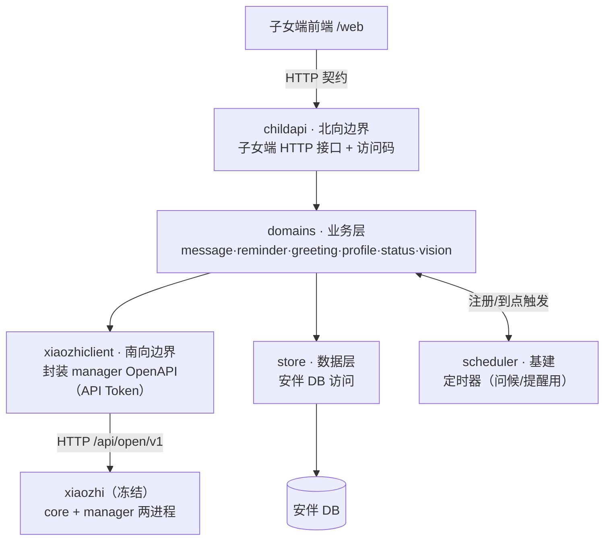

# 安伴模块化分解与仓库规划（分层 · 分域 · 分工）

> 类型：模块化结构设计。把 [服务端架构设计](./2026-05-28-server-architecture-design.md) 的"安伴后端"细化成**可照着建仓库、分文件夹、派活**的多层分解树。
> 关系：上承架构设计（C 方案）；下供《团队开发手册》Part 5 与未来 writing-plans 使用。
> 状态：① 2026-05-28 通过用户逐节复核（"暂时先这个 OK"）；② **2026-05-29 据 xiaozhi 真代码深读校正**（见 §0）。
> 两个已锁定的决策：① 功能模块**按业务域分解，子女🔵/自主🟢 当标签**（不按驱动方劈文件夹）；② 安伴自研代码用**一个 monorepo**（后端 + 前端同仓）。

---

## 0. 代码核实结论（2026-05-29，深读 xiaozhi 真代码后）

**来源**：用 codegraph 索引 xiaozhi 全仓（463 文件）+ 7 路并行逐行深读，产出 [架构总览](./2026-05-29-xiaozhi-architecture-deep-dive.md) + [接缝级全景（安伴对照版）](./2026-05-29-xiaozhi-full-architecture-map.md) + 7 本分册（`./xiaozhi-deep-dive/01~07-*.md`）。上次设计里"待 W1 核实"的 5 条已全部落到代码级。

**三条直接影响本设计的结论：**

1. **"要不要再分两个服务"——有答案了。** xiaozhi 上游**本身就是「核心服务 core + 控制面 manager」两个进程**，二者只靠"一条双向 WS 事件总线 + 一组 REST"耦合、各自一套 DB（且可经编译 tag 内嵌成一进程跑）。所以安伴做**第三个对等服务**是顺着上游既有架构走，不是新增架构负担。
   → **安伴后端保持「一个服务」，不再内部拆分进程。** 整体拓扑 = `core + manager + 安伴` 三个对等服务。

2. **南向适配器比原设计预想的更简单、更干净。** 原假设 `xiaozhiclient` 要直连 core 的 `speak_request`；实测有**更高层、带鉴权的 manager 入口**：`POST /api/open/v1/devices/inject-message`（API Token）。安伴需要的 **8 项能力里 7 项是 manager 现成认证 REST（契约档①）**，`xiaozhiclient` 实际只是一个 **manager OpenAPI 的 HTTP 客户端**（见 §2.1）。

3. **唯一落契约档②/③的，是"视觉主动周期采帧"。** Vision 是**设备推送式**（`POST /xiaozhi/api/vision` 只收设备上传），没有"服务端命令设备现在拍一帧"的 API。要主动采帧只能：设备注册"拍照"MCP 工具 + 安伴经 `/devices/:id/mcp-call` 触发（**档②，推荐，不碰核心**），或改固件定时上传（档③）。本就在可降级清单。

> **总结**：本设计的**分层 / 分域 / 分工结构全部成立，无需改**。校正的只是把 `xiaozhiclient` 的"对端"从假设的"core speak_request"明确为"**manager OpenAPI**"，并把每个域的驱动入口落到具体端点（见 §2.1、§3）。

---

## 1. Level 0：四顶层模块（按归属 + 冻结/自研）

| # | 模块 | 性质 | 位置 |
|---|---|---|---|
| 1 | `xiaozhi-esp32` 设备固件 | 上游·冻结 | 仓库之外（clone 来烧录） |
| 2 | `xiaozhi-esp32-server-golang` 语音服务（**含 core + manager 两进程**） | 上游·冻结 | 仓库之外（clone/部署，或独立 fork） |
| 3 | 安伴后端（Go，**单服务**） | 自研 | `anban` monorepo `/server` |
| 4 | 安伴子女端前端（Web） | 自研 | `anban` monorepo `/web` |

边界线：**模块 3、4 = "我们改的"，在一个 monorepo 内；模块 1、2 = "我们只用的"，永远在仓库之外。**
拓扑：安伴（模块 3）作为**第三个对等服务**，通过 manager 的 OpenAPI 驱动冻结的 xiaozhi（模块 2）。

---

## 2. Level 1：安伴后端内部分层（按朝向/职责）

用户的"功能 / 前后端对接 / 与 xiaozhi 对接"三分，本质是分层架构：



| 层/件 | 角色 | 对应用户说法 |
|---|---|---|
| `childapi` | 北向边界：子女端唯一入口 + 访问码鉴权 | "前后端对接模块" |
| `domains` | 业务层：6 个功能域（Level 2） | "功能模块" |
| `xiaozhiclient` | 南向边界：封装 manager OpenAPI（`/api/open/v1`，API Token） | "与 xiaozhi 对接模块" |
| `store` | 数据层：安伴自有 DB 存取 | （新明确） |
| `scheduler` | 基建：定时能力，问候/提醒注册任务、到点回调 | （新明确） |

### 2.1 xiaozhiclient 的接口（实测可落地，5 个方法）

深读把南向缝从"假设"变成"已知"。`xiaozhiclient` 就是一个 **manager OpenAPI 的 HTTP 客户端**，建议封装这 5 个方法（建议签名 + 实测对应端点）：

| 方法（建议签名） | 调的 manager 端点 | 服务于哪个域 |
|---|---|---|
| `InjectSpeak(deviceID, text, opts{skipLLM, autoListen})` | `POST /api/open/v1/devices/inject-message` | message / reminder / greeting |
| `GetDeviceStatus(deviceID) → {online, lastActiveAt}` | `GET /api/open/v1/devices(/:id)`（`last_active_at`） | status |
| `GetHistory(deviceID, limit)` | `GET /api/open/v1/.../history/messages`（只读） | status / 子女端深度（加分） |
| `SetRolePrompt(deviceID|agentID, prompt)` | manager role / agent API（写人设 prompt） | profile |
| `CallDeviceMCPTool(deviceID, tool, args)` | `POST /api/open/v1/devices/:id/mcp-call` | vision（拍照，档②）/ 其他设备能力 |

**两条铁律（来自深读安全汇总）：**
- 鉴权统一用 **API Token**（manager `/api/user/api-tokens` 签发）走 `/api/open/v1`——这是 xiaozhi 里鉴权最规整的路径。
- **绝不**调用 core 上那个**无任何鉴权**的 `/admin/inject_msg`（深读 §10 列为风险）。

> `InjectSpeak` 的 `skipLLM`（直接念原话 vs 过 LLM 润色）和 `autoListen`（播完是否自动续听）是 inject-message 的现成参数——留言/提醒/问候直接用。

---

## 3. Level 2：业务层 = 6 个业务域（域为主，🔵子女 / 🟢自主 当标签）

| 业务域 | 包 | 标签 | 驱动 xiaozhi 的入口（见 §2.1） | 职责 |
|---|---|---|---|---|
| 留言 | `domains/message` | 🔵+🟢 | `InjectSpeak`（skipLLM） | 子女发留言 → 挑时机让设备播 |
| 提醒 | `domains/reminder` | 🔵+🟢 | `InjectSpeak` + scheduler | 子女设提醒 → 到点播 + 应答跟踪 |
| 问候 | `domains/greeting` | 🔵+🟢 | `InjectSpeak` + scheduler | 定时/手动触发主动问候 |
| 画像 | `domains/profile` | 🔵+🟢 | `SetRolePrompt` | 子女编辑画像 → 写 manager 人设 prompt |
| 状态 | `domains/status` | 🔵 | `GetDeviceStatus` + `GetHistory` | 聚合在线/最近互动给子女看 |
| 视觉 | `domains/vision` | 🟢 | `CallDeviceMCPTool`（拍照，**档②**） | 摄像头判有人 → 触发问候（**可降级**） |

"子女相关 vs 安伴功能"作为**每个域的标签**呈现，不劈开文件夹——留言仍由一人端到端拥有。

**每个域统一内部骨架**（给成员 + Agent 固定模板）：
```
domains/<域>/
├── handler.go   # 对外入口（被 childapi 或 scheduler 调）
├── service.go   # 业务逻辑（核心）
├── store.go     # 该域数据存取（只管本域的表）
└── types.go     # 该域数据结构
```

> 两个 "store" 别混：**域内 `store.go`** 只管本域的表，通过**共享 `internal/store` 包**拿数据库连接；共享 `store` 管连接和通用助手，不含任何域的业务表逻辑。

> 深层"对话记忆沉淀/召回"**已核实**靠 xiaozhi 自带 MemoryProvider（mem0 / memobase / memos 已集成，注入点在 `LLMManager.GetMessages`）；记忆后端经 manager memory-config 一次性选定，`profile` 域只管家庭画像（写人设 prompt），**不重造记忆库**。

> `vision` 域是**旁路**且**唯一落档②**的域：它崩不拖累语音主链路；做不出来按 PRD §7 降级到加分层。建议交由能 hold 不确定性的成员 + 组长协助。

---

## 4. 前端分解 + 两条"对接缝"

前端按页面/功能分，与后端域一一镜像：
```
web/src/
├── api/          # ←→ 后端 childapi 的镜像（封装所有 HTTP 调用）★对接缝
├── pages/{login,status,message,remind,profile}/
└── components/
```

两条对接缝（= 用户说的两个对接模块）：
- 前端 `api/` ←→ 后端 `childapi`：**前后端对接缝**，双方先定契约再各写。
- 后端 `xiaozhiclient` ←→ **manager OpenAPI**：**后端–xiaozhi 对接缝**，组长一人守（接口见 §2.1）。

---

## 5. 完整 monorepo 目录树

```
anban/                          # monorepo（GitHub）
├── server/                     # 安伴后端（Go，单服务）
│   ├── cmd/anban/              # 入口：main、装配各模块
│   ├── internal/
│   │   ├── childapi/           # 北向边界（子女端接口 + 访问码）
│   │   ├── domains/            # 业务层（域为主）
│   │   │   ├── message/
│   │   │   ├── reminder/
│   │   │   ├── greeting/
│   │   │   ├── profile/
│   │   │   ├── status/
│   │   │   └── vision/
│   │   ├── xiaozhiclient/      # 南向边界（manager OpenAPI 客户端，见 §2.1）
│   │   ├── scheduler/          # 基建（定时）
│   │   └── store/              # 数据层（安伴 DB）
│   └── pkg/types/              # 跨模块共享数据结构/契约
├── web/                        # 子女端前端
│   └── src/{api,pages,components}/
├── deploy/                     # docker-compose：anban + xiaozhi(core+manager) 一起起
└── docs/                       # （可选）接口契约
```

---

## 6. 责任田映射（结构 ≠ 分工；这里是分工，4–6 人）

| 负责人 | 责任田 | 说明 |
|---|---|---|
| 组长 | `xiaozhiclient` + `scheduler` + `store` + 部署 + 审 PR | 守南向缝（manager OpenAPI 封装）+ 公共基建，把复杂度挡门口 |
| 成员 A | `domains/greeting` + `domains/reminder` | 都靠 scheduler + `InjectSpeak`，天然一人 |
| 成员 B | `domains/message` | 留言端到端 |
| 成员 C | `domains/vision` | 唯一落档②、不确定性高，组长协助 |
| 成员 D | `domains/profile` + `domains/status` | 都偏轻 |
| 成员 E | `childapi` + `web/` | 前后端对接一条龙（守北向缝） |

- 4 人：D 并给组长或 B。
- 6 人：vision 拆两人，或 childapi 与 web 分两人。

---

## 7. 模块化纪律（依赖规则——结构的脊梁，也是 Agent 不许越界的依据）

1. `childapi` → 调 `domains`；不直接碰 `xiaozhiclient`/`store`。
2. `domains` → 只能调 `xiaozhiclient`、`store`、`scheduler`、`pkg/types`。
3. **`domains` 之间不互相 import**（协作走 `pkg/types` 接口或经 `childapi` 编排）——保证一人改一域不连累别人。
4. `xiaozhiclient` → 只调 manager OpenAPI，不反向碰任何 domain。
5. 只有 `xiaozhiclient` 知道 xiaozhi 存在；只有 `store` 知道数据库存在。

---

## 8. 与其他文档的关系 + 落地次序

- **上承**：[服务端架构设计](./2026-05-28-server-architecture-design.md)（C 方案：独立 Go 安伴服务 + 冻结 xiaozhi）。本文是其"安伴后端"的内部细化。
- **代码依据**：[xiaozhi 架构总览](./2026-05-29-xiaozhi-architecture-deep-dive.md) 与 [接缝级全景](./2026-05-29-xiaozhi-full-architecture-map.md)——后者 §9 的"冻结 vs 扩展落点对照表"是 §2.1 五个方法的直接来源；§10 安全提示是 §2.1 两条铁律的来源。
- **下供**：《团队开发手册》Part 5（目录树 + 分工已按本文回填）；未来 writing-plans 按本文每个域/边界细化到接口。
- **契约档位（已由深读核实，替代原"待定"）**：8 项能力 7 项落**档①**（manager 现成认证 REST，`xiaozhiclient` 直接封装）；仅"视觉主动采帧"落**档②**（设备注册拍照 MCP 工具 + `mcp-call`），不碰核心。无一项需要 fork core。
- **建议下一步**：
  1. 组长据 §2.1 给 `xiaozhiclient` 落一版**真接口骨架**（现在已能写真的，不必再用假接口）+ 一个 manager API Token 的获取/配置说明。
  2. 把深读 §10 的安全收敛项（CORS / WS CheckOrigin / 默认弱口令 / core `/admin/inject_msg` 无鉴权）提升为一条 `decisions/` 记录——**安伴若把 manager 暴露公网前必须处理**。
  3. 各域对着 §2.1 的 5 个方法并行起骨架。
