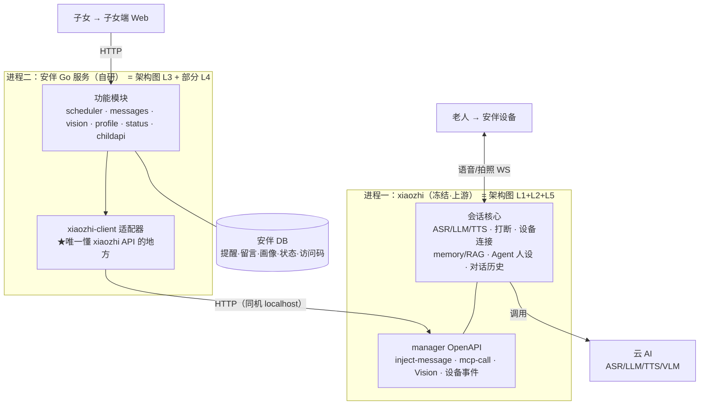
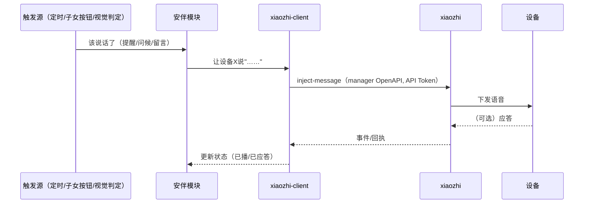

# 安伴服务端架构设计（C 方案：独立 Go 安伴服务 + 冻结 xiaozhi）

> 类型：High-level 架构设计（偏架构层，不下沉到 endpoint）。
> 关系：落实 PRD §4 系统架构 与 [架构图.md](./架构图.md) 的 L3 安伴自研功能层；本文回答"L3 到底怎么落地、和 xiaozhi 怎么划界"。
> 状态：① 2026-05-28 通过用户逐节复核；② **2026-05-29 据 xiaozhi 真代码深读核实**（§12 待确认 5 条已全部落代码级；精确南向接口见 [模块化分解](./2026-05-28-module-decomposition-design.md) §2.1）。
> 决策摘要：**安伴功能做成一个独立的 Go 服务，通过 manager 的 OpenAPI（API Token）驱动一个冻结的 xiaozhi；不在 xiaozhi 代码库里原地深改。**

---

## 1. 背景与目标

- 设备端 `xiaozhi-esp32`、服务端 `xiaozhi-esp32-server-golang` 是**直接复用**的上游项目（CLAUDE.md §5），尽量不改。
- 安伴的"灵魂"（主动问候/提醒、留言播报、记忆画像、视觉触发、子女端连接）= 架构图的 **L3 安伴自研功能层**，是全部要新增的部分。
- 本设计要回答用户的两个原始疑问：
  1. L3 是**在 xiaozhi 代码上原地扩展**，还是**另写独立服务**？→ 本文锁定独立服务（方案 C）。
  2. 安伴功能会不会要**改设备端固件**？→ 基本不用；**已核实**唯一例外是"视觉周期采帧"（落契约档②，走设备拍照 MCP 工具，仍不改固件；详见 §8）。

**关键事实来源**：后端分析文档 + **2026-05-29 全仓真代码深读**（[架构总览](./2026-05-29-xiaozhi-architecture-deep-dive.md) / [接缝级全景](./2026-05-29-xiaozhi-full-architecture-map.md)）已核实：xiaozhi 具备 manager 主动播报、Vision、memory/RAG、Agent/Role 人设、MCP 工具、OpenAPI、对话历史、设备在线事件。**精确调用方式已落到代码级，且比原假设更优**——主动播报走 manager 的认证 OpenAPI（`POST /api/open/v1/devices/inject-message`），而非直连 core 的 `speak_request`。

---

## 2. 决策：为什么是 C（独立服务），不是 A（原地改）

| | A 原地改 | B 全黑盒独立 | **C 独立服务 + 冻结 xiaozhi（选定）** |
|---|---|---|---|
| 进程 | 1（改装版 xiaozhi） | 2 | 2（原版 xiaozhi + 安伴 Go 服务） |
| 碰核心 | 深度耦合 | 零 | 核心冻结，仅必要时加隔离插件 |
| 爆炸半径 | 大，能拖垮语音主链路 | 最小 | 小 |
| 并行 Coding Agent | 高冲突、易连坐 | 隔离 | 隔离 |
| 升级上游 | fork，合并痛 | 干净 | 基本干净 |
| 省事 | 复用现成但易改错 | 隔离但受 API 暴露限制 | 复用现成 + 新东西隔离写 |

**决策驱动**（来自用户）：① 省事；② 最怕"有人/Coding Agent 改错了拖垮全局、连之前对的都坏"；③ 团队并行、都用 Coding Agent。
A 与②③直接冲突（大 Go 仓库里多个 Agent 并行改、易连坐）。C 命中三条：复用 xiaozhi 现成能力（省）、核心冻结（防爆炸半径）、独立仓库分模块（并行）。

**语言**：安伴服务也用 Go（用户已定）。注意——同语言 ≠ 同代码库；隔离来自**进程/仓库边界**，与语言无关。

**部署复杂度**：两个 Go 服务 + 子女端前端，用一个 `docker compose up` 一起起，运维仍是一条命令。

> 本节是一个架构决策，可按需提升为 `docs/decisions/<日期>-server-architecture.md`。

---

## 3. 系统全景（进程边界叠到分层上）

架构图.md 的 L0–L5 回答"有哪些层"；本图把 **L3 是一个独立进程、跨边界调 L2** 这件事画出来。

三点：① 语音环全在 xiaozhi 内，C 不碰；② 安伴所有对外调用收口到 `xiaozhi-client`；③ 两套 DB 物理分开。

---

## 4. 两进程职责边界

| | xiaozhi（冻结） | 安伴 Go 服务（自研） |
|---|---|---|
| 拥有 | 语音对话、打断、ASR/LLM/TTS 编排、设备连接、对话历史、memory/RAG、Agent 人设、Vision 识别 | 调度、留言、画像编辑、视觉触发逻辑、设备状态聚合、子女端接口、访问码 |
| 不做 | 任何"安伴特色编排"（它不懂"提醒""留言"） | 任何语音/ASR/LLM/TTS（一律托付 xiaozhi） |
| 被谁驱动 | 被安伴通过 API "打电话"驱动 | 被子女端 HTTP、被自己的定时器驱动 |

**一句话边界**：xiaozhi 管"让设备说话/听话"，安伴管"何时、说什么、为什么说"。

---

## 5. 安伴 Go 服务的内部模块（隔离单元）

每个模块单一职责，可被不同 Coding Agent 并行认领：

| 模块 | 职责 | 依赖 | 对外 |
|---|---|---|---|
| `childapi` | 子女端 HTTP 接口 + 访问码鉴权 | 其余模块 | → 子女端 Web |
| `scheduler` | 定时问候/提醒 cron + 子女触发 | `xiaozhi-client` | 内部 |
| `messages` | 留言队列与生命周期（pending→played→acked） | `xiaozhi-client` | 内部 |
| `vision` | 视觉触发状态机（无人→有人→触发） | `xiaozhi-client` | 内部 |
| `profile` | 家庭画像存取（+ 写入 xiaozhi Agent 人设） | `xiaozhi-client` | 内部 |
| `status` | 聚合"在线/最近互动/留言状态"给子女端 | `xiaozhi-client` | 内部 |
| **`xiaozhi-client`** | **唯一封装 xiaozhi 调用（= manager OpenAPI 客户端）** | — | 所有模块经它出网 |

**`xiaozhi-client` 是本设计最重要的隔离点**：**已核实**它就是一个 manager OpenAPI（`/api/open/v1`，API Token）的 HTTP 客户端，5 个方法签名见 [模块化分解 §2.1](./2026-05-28-module-decomposition-design.md)；接口若有变**只改这一个包**，上面 6 个模块不动；并行 Agent 写各模块时也**不必各自懂 xiaozhi 协议**。

---

## 6. 统一数据流形状（几乎所有安伴主动行为都长这样）

变体只是"触发源/前置步骤"不同：
- **提醒/问候**：触发源 = `scheduler` 的 cron 或子女按钮。
- **留言**：触发源 = 子女发留言进 `messages` 队列。
- **视觉触发**：前面多一步——`vision` 先令 xiaozhi 拍帧 → VLM 判"有人" → 才进入上面形状。
- **设备状态**：唯一反向——`status` 读 xiaozhi 设备事件/历史聚合给子女端，不下发。

> 架构含义：**主动下发是唯一公共动脉**（架构图风险 ②）；在 C 里就是 `xiaozhi-client.InjectSpeak()` → manager `inject-message`（支持 skip_llm / auto_listen）。单点，但收口干净、好兜底。

---

## 7. 数据归属与"单一真相源"原则

铁律：**安伴 DB 绝不复制 xiaozhi 已是真相源的数据。**

| 数据 | 真相源 | 另一方 |
|---|---|---|
| 对话历史、Agent 人设、memory/RAG | xiaozhi DB | 安伴按需读，不存副本 |
| 提醒、留言、视觉触发状态、访问码 | 安伴 DB | xiaozhi 不知其存在 |
| 家庭画像 | 安伴 DB 为编辑源，写入时同步进 xiaozhi Agent 人设 | 子女端改画像 → 安伴存 + 推给 xiaozhi |
| 设备在线/最近互动 | xiaozhi（设备事件） | 安伴 `status` 读后只缓存薄快照供展示 |

---

## 8. 与 xiaozhi 的契约：三档（✅ 已据真代码定档，2026-05-29）

按"碰核心程度"从轻到重，能轻不重：

1. **档①纯调 API**（理想·零 fork）：manager OpenAPI（inject-message / 设备状态 / 历史 / role / mcp-call）→ `xiaozhi-client` 全搞定，xiaozhi 一行不改。
2. **档②加隔离插件**：某能力 API 未直接暴露但可用 MCP 工具/hook 补 → 设备/xiaozhi 加独立插件，不碰会话核心。
3. **档③极轻 fork**（最后手段）：某功能只能改核心 → 加最小、隔离的补丁，记进 `decisions/`。

**实测落档分布**：安伴 8 项能力 **7 项落档①**（manager 认证 REST）；**唯一落档②的是视觉"周期性采帧"**——Vision 是**设备推送式**（无"服务端命令拍帧"API），故走"设备注册拍照 MCP 工具 + manager `/devices/:id/mcp-call`"（不碰核心、不改固件）。该项本在 PRD 可降级清单，不阻塞主线。**无一项需要 fork core。**

---

## 9. 子女端

- **本设计默认 Web**（与 PRD §5、架构图一致）。
- 架构上子女端在边界之外（前端 → `childapi`）；**做 Web 还是原生 App 不改后端边界**，仅换前端栈。
- 若后续改原生 App，本设计第 3–8 节不变，只在第 5 节 `childapi` 之上换一套前端。

---

## 10. 三周映射（贴合架构图图二）

| 周 | 安伴 Go 服务 | xiaozhi |
|---|---|---|
| W1 | 据 §2.1 落 `xiaozhi-client` **真接口**（探接口已于 2026-05-29 完成）+ 各域起骨架 | 单独跑通语音主链路（48h 闸门护 L1+L2+L5a） |
| W2 | 6 模块全接入、连真后端、子女端切真数据 | 冻结；被安伴驱动 |
| W3 | 加固 + 兜底视频 + 彩排 | 冻结 |

---

## 11. 风险（继承架构图 ②③④ + C 新增一条）

| # | 风险 | 处置 |
|---|---|---|
| ② | 主动下发是 W2 三特色共用单点 | C 里收敛为 `xiaozhi-client.Speak()` 单函数；兜底=子女端按钮手动逐次触发 |
| ③ | 记忆 L4 方案 W1 才定 | `decisions/` + 降级 4 级；画像走"配置优先"已减负 |
| ④ | W2 负载尖峰（记忆+视觉） | "谁先卡死谁先按降级表退，不并行死磕"；视觉是旁路不拖累对话 |
| ⑤ | ~~xiaozhi API 与假设不符~~ | ✅ **已关闭（2026-05-29）**：API 已读到代码级，确认走 manager OpenAPI；比假设更优。仍收口到 `xiaozhi-client` 单点 |

---

## 12. 核实清单（✅ 已于 2026-05-29 读真代码核实）

依据：[架构总览](./2026-05-29-xiaozhi-architecture-deep-dive.md) / [接缝级全景](./2026-05-29-xiaozhi-full-architecture-map.md)（codegraph 索引 463 文件 + 7 路并行深读）。

- [x] **主动播报精确入口** → 更优路径：`POST /api/open/v1/devices/inject-message`（manager，API Token）；链路 `OpenAPI→manager→WS→core.HandleInjectMsg→ChatManager.InjectMessage`；支持 `skip_llm`（原话 vs 过 LLM）/ `auto_listen`（播完续听）。不必直连 core 的 `speak_request`。
- [x] **读设备在线/最近互动** → manager 设备 API 的 `last_active_at`（真相源在 manager DB，core 经 WS 实时更新）。喂 `status` 域。
- [x] **Vision 能否服务端命令拍帧** → **不能**；Vision 是设备推送式（`POST /xiaozhi/api/vision` 仅收设备上传）。故视觉采帧落**档②**：设备注册拍照 MCP 工具 + `/devices/:id/mcp-call`。
- [x] **OpenAPI 鉴权方式** → **API Token**（manager `/api/user/api-tokens` 签发）走 `/api/open/v1`；core 的 `/admin/inject_msg` **无鉴权，禁用**。
- [x] **Agent 人设可否外部写入** → **可**；经 manager role/agent API 写 prompt 即改 system prompt。`profile` 域据此同步。

---

## 与其他文档的关系

- **PRD §4**：本文是 L3 的落地设计；建议 PRD §4 加一句指针到本文。
- **架构图.md**：本文第 3 节"进程边界图"建议补进架构图（已同步）。
- **decisions/**：本文第 2 节的 A/B/C 决策可提升为一条 decision；第 8 节契约档位、记忆路线由 W1 决策文档定。
