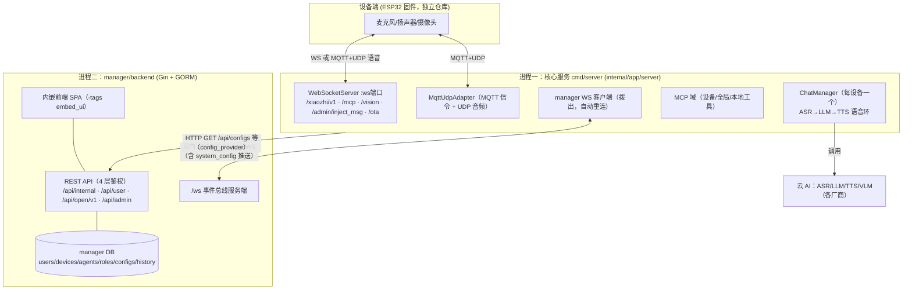
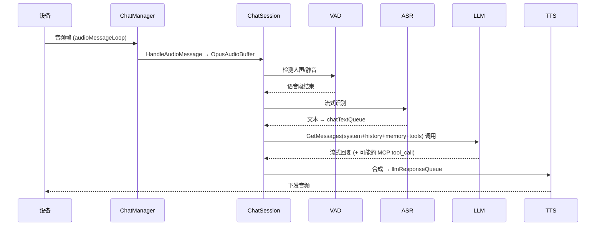

# xiaozhi-esp32-server-golang 全貌架构地图（安伴对照版）

> 类型：上游代码库系统性通读产出的**架构全景参考**（非安伴设计文档）。
> 读法：codegraph（索引 463 文件）做符号/调用链导航 + 对入口与接缝文件做逐行精读。
> 目的：给安伴团队一份"冻结 xiaozhi 时它到底长什么样"的地图，配合
> [`2026-05-28-server-architecture-design.md`](./2026-05-28-server-architecture-design.md)（方案 C）使用。
> 阅读边界：本文覆盖**进程/分层/接缝/数据流**到代码级；不下沉到各 ASR/TTS/LLM 厂商适配器内部实现。
> 状态：2026-05-29 通读完成。文末「覆盖与盲区」诚实列出未深读部分。

---

## 0. 一句话结论（先看这个）

**xiaozhi 上游本身就是「核心服务 + manager 控制面」两个进程**，二者只靠
**一条双向 WebSocket 事件总线 + 一组 HTTP/REST** 耦合，各自一套 DB。
所以安伴做成「第三个对等服务」是顺着上游既有架构走，不是新增架构负担。
安伴需要的所有驱动能力（主动播报、设备状态、人设、记忆、MCP 工具调用）
**都已经是 manager 暴露的认证 REST 或事件总线消息**，无需改核心。

---

## 1. 顶层进程拓扑

**三条事实**
1. 设备语音环**全在核心服务内**（ASR/LLM/TTS/打断/会话），manager 不碰音频。
2. 核心服务**被 manager 驱动也被 manager 喂配置**：配置走 HTTP 拉取 + WS 推送热更；
   主动指令（播报/MCP 调用）走 WS 事件总线下行。
3. **可选内嵌**：`cmd/server` 支持 `-manager-enable` / `-asr-enable` 把 manager、asr_server
   塞进同一进程跑（`main.go:35-40`，`StartManagerHTTP` / `StartAsrServerHTTP`）。
   即「逻辑两服务、物理可一进程」——部署灵活度比想象高。

---

## 2. 启动与装配链（cmd/server）

`main.go` → `Init()`（config.go）→ `server.NewApp().Run()`（app.go）

| 阶段 | 代码 | 做了什么 |
|---|---|---|
| ① 可选起 manager/asr | `main.go:35-40` | 内嵌模式：先起 manager，否则 `Init` 拉配置会卡死 |
| ② 读本地配置 | `config.go initConfig` | viper 读 yaml |
| ③ 配置系统 | `user_config.InitConfigSystem` | 建立 manager WS 客户端连接 |
| ④ 拉系统配置 | `updateConfigFromAPI` | `configProvider.GetSystemConfig` 拉 mqtt/udp/ota/vision 等并 merge 进 viper，**失败无限重试** |
| ⑤ 周期刷新 | `startPeriodicConfigUpdate` | 默认 30s 拉一次 |
| ⑥ VAD/Redis/Auth | `initVad/initRedis/initAuthManager` | VAD/记忆懒加载；auth 管 session |
| ⑦ system_config 热更 | `main.go:65-129` | 注册回调：WS 推送配置变更 → diff → 选择性 `ReloadMqttServer/ReloadMqttUdp/ReloadMCP` |
| ⑧ App.Run | `app.go:60-93` | 起 wsServer + mqtt + mqttUdp + 本地 MCP 工具 + 事件处理器 + 资源池上报 |

**关键全局对象 `App`（app.go:30）**
- `chatManagers cmap[deviceID]*ChatManager`：**一设备一 ChatManager**。
- `OnNewConnection`（app.go:314）：任何传输（WS / MQTT-UDP）新连接 → 建 ChatManager → `DeviceOnline`（向 manager 发事件）→ goroutine 跑 `chatManager.Start()`；断开 → `DeviceOffline`。
- `registerHandler`（app.go:499）：向 config provider 注册 **下行事件** `EventHandleMessageInject` → `HandleInjectMsg` → `chatManager.InjectMessage`。**这是 manager 远程驱动播报的落点。**

---

## 3. 核心语音环：ChatManager / ChatSession

### 3.1 ChatManager（chat/chat.go） — 每设备的连接与会话生命周期管家
- `Start()`（chat.go:318）起两条循环：
  - `cmdMessageLoop`：收文本/控制帧 → `handleTextMessage` 分发：`Hello/SpeakReady/Listen/Abort/Iot/Mcp/GoodBye`。
  - `audioMessageLoop`：收音频 → `session.HandleAudioMessage` → `OpusAudioBuffer`。
- `GenClientState`（chat.go:222）：**建连即用 `configProvider.GetUserConfig(deviceID)` 拉该设备整份配置**（ASR/LLM/TTS/VAD/Memory provider + SystemPrompt + AgentId + MemoryMode + MCPServiceNames + 声纹 + OpenClaw）。
- 会话懒建：hello/listen 时 `ensureSession` 建 `ChatSession`；支持「保留态」（goodbye 后保留一段时间复用，`retainedSessionCleanup`）。
- **chat hooks / plugins**（chat.go:145-217）：`chathooks.Hub` + `RegisterBuiltinPlugins` + `streamtransform.Registry`，异步执行器，按 viper `chat_hooks.plugins.*` 开关。**这是核心内的官方扩展点**（档②插件的天然落点）。
- **主动播报 `InjectMessage`（chat.go:1203）**：`prepareSpeakPathForInjectedSpeech`（MQTT-UDP 下先发 `speak_request` 等 `speak_ready`，WS 下直接走）→ `skipLlm? AddTextToTTSQueue : AddAsrResultToQueue`。

### 3.2 ChatSession（chat/session.go 等）— 真正的 ASR→LLM→TTS 流水线
- `InitAsrLlmTts`（session.go:429）：初始化 ASR + Memory provider；长记忆模式预取 `GetContext` 存 `MemoryContext`。
- `initHistoryMessages`（session.go:303）：按 `config_provider.type` 从 **Redis** 或 **Manager**（`loadFromManager` → `/internal/history/messages`）载入近 20 条历史。
- LLM 组装在 `LLMManager.GetMessages`（llm.go:1151）：system prompt = 角色 prompt + 全局 prompt + 时间 + **记忆注入** + 声纹 prompt + 知识库路由策略。
- 资源（ASR/LLM/TTS/VAD）走**资源池**（`internal/pool`，懒加载，5s 上报 manager）。

---

## 4. 耦合骨架：manager ↔ core 的两条通道

### 4.1 配置通道（HTTP 拉取，core→manager，`config_provider.type=manager|redis`)
`UserConfigProvider` 接口（`internal/domain/config/interface.go`）是**唯一抽象边界**：

| 方法 | 用途 | manager 实现端点 |
|---|---|---|
| `GetUserConfig(deviceID)` | 设备整份配置 | `GET /api/configs` |
| `GetSystemConfig()` | mqtt/udp/ota/vision | `GET /api/system/configs` |
| `IsDeviceActivated/GetActivationInfo/VerifyChallenge` | 激活 | `/internal/device/*` |
| `SwitchDeviceRoleByName/RestoreDeviceDefaultRole` | 人设切换 | `/internal/devices/:name/switch-role` |
| `NotifyDeviceEvent`（上行） | 设备上下线 | 走 WS 事件总线 |
| `RegisterMessageEventHandler`（下行） | 收消息注入 | 走 WS 事件总线 |

实现：`manager`（HTTP+WS）与 `redis` 两种，注册式 `GetProvider(type)`。

### 4.2 事件总线（双向 WS JSON-RPC，`internal/domain/config/manager/websocket_client.go` ↔ `manager/backend/controllers/websocket.go`)
- 核心**拨出**到 manager `/ws`，JWT（`GetManagerEndpointAuthToken`，purpose `manager-ws-client`）+ UUID，**指数退避自动重连**，30s 心跳。
- 协议：`{id,method,path,body}` 请求 / `{id,status,body,error}` 响应，**任一方可发起**。

| 方向 | path | 作用 |
|---|---|---|
| core→mgr | `/api/device/active` `/api/device/inactive` | 更新 `Device.last_active_at`（**设备在线/最近互动真相源在此**） |
| core→mgr | `/api/ws/status` `/internal/pool/stats`(HTTP) | 状态/资源池上报 |
| **mgr→core** | `/api/device/inject_msg` | `InjectMessageToDevice` 广播 → core `HandleInjectMsg` → **主动播报** |
| mgr→core | `/api/mcp/tools` `/api/mcp/call` | 列/调设备或 agent 的 MCP 工具 |
| mgr→core | `/api/openclaw/chat` `/api/config/test` | OpenClaw 对话测试 / 配置连通性测试 |
| mgr→core | `type:system_config` 推送 | 配置热更（→ viper merge + reload） |

> 含义：**manager 是控制面，core 是执行面**；manager 能远程让任意在线设备说话、调它的 MCP 工具、热更它的配置——全程不重启 core。

### 4.3 REST 通道（manager 对人/对外，`manager/backend/router/router.go`，四层鉴权）

| 分组 | 中间件 | 谁用 | 关键端点 |
|---|---|---|---|
| `/api/internal/*` | `InternalServiceAuth(token)` | **core↔manager 服务间** | configs、system/configs、history、pool/stats、device activate、switch-role |
| `/api/user/*` | `JWTAuth` | 子女/网页用户 | devices、agents、roles、knowledge-bases、voice-clones、speaker-groups、history、**`/devices/inject-message`**、mcp-tools/call |
| `/api/open/v1/*` | `OpenAPIAuth`（JWT 或 **API Token**） | **外部程序（安伴可用）** | devices、agents、history、**`/devices/inject-message`**、`/devices/:id/mcp-tools`、`/devices/:id/mcp-call` |
| `/api/admin/*` | `AdminAuth` | 管理员 | 全部 *-configs CRUD（vad/asr/llm/tts/vision/ota/mqtt/mcp/memory/knowledge-search）、用户管理、配置导入导出/测试、pool/stats |

**对安伴最关键**：`POST /api/open/v1/devices/inject-message`（API Token 鉴权）= 现成、认证良好的「主动播报」入口，链路为
`OpenAPI → userController.InjectMessage → WebSocketController.InjectMessageToDevice → WS → core.HandleInjectMsg → ChatManager.InjectMessage`。
安伴不必碰 core 上那个**无鉴权**的 `/admin/inject_msg`。

---

## 5. 域层 provider 注册模式（internal/domain）

全域统一「接口 + 工厂注册」模式，配置选实现。安伴扩展任何一类 = 实现接口 + 注册一个 case，**注入点不动**。

| 域 | 接口/工厂 | 实现 |
|---|---|---|
| config | `UserConfigProvider` / `GetProvider` | manager、redis |
| memory | `MemoryProvider` / `GetProvider`（memory/base.go） | nomemo、memobase、mem0、memos(兼容mem0) |
| asr | `adapter.go`/`base.go` | doubao、aliyun_funasr、aliyun_qwen3、xunfei、funasr |
| tts | `tts/base.go` | doubao、qwen、openai、zhipu、cosyvoice、indextts_vllm |
| llm | `llm/llm.go`/`base.go` | eino 通用 + dify_llm、coze_llm |
| vad | `vad/base.go` | webrtc、ten_vad（懒加载，资源池） |
| rag | `rag/interface.go`/`manager.go` | dify、ragflow、weknora（知识库检索，作为 LLM 工具） |
| mcp | 见 §6 | 设备 MCP / 全局 MCP / 本地工具 |
| vision | `vllm.go` + websocket/vision.go | 设备 POST 图片 → VLLM（见 §7） |
| speaker | `speaker/*` | 声纹识别（asr_server 流式） |
| openclaw | `openclaw/manager.go` | "龙虾" 外部 agent 桥接（关键词进入/退出 + 离线补发） |

### 记忆注入（④的精确落点）
- 长记忆 provider 由 `DeviceConfig.Memory.Provider`（manager 下发）选定。
- 注入点唯一：`LLMManager.GetMessages`（llm.go:1181/1203）把 `GetContext` 结果拼为「用户个性化信息」、把每轮 `Search` 结果拼为「历史关联信息」进 system prompt。
- 写回：`MemoryProvider.AddMessage`/`Flush`（memobase 异步 Insert）。

---

## 6. MCP 架构（工具能力面）

四类来源，最终在 LLM 处合成 function-calling 工具：
1. **设备 MCP**：设备通过 WS `/mcp?token=`（websocket/mcp.go:23）上报自己的工具（IoT 控制、可含摄像头/拍照等）。`GetDeviceMcpClient` / `NewWsEndPointMcpClient`。
2. **全局 MCP**：`GlobalMCPManager` + `StartMCPManagers()`，按设备配置 `MCPServiceNames` 选择性下发；可热更（`ReloadMCP`）。
3. **本地工具**：`chat/local_mcp_tool.go`（音乐搜索/播放）、`local_mcp_media_control_tool.go`。
4. **会话工具**：`chat/session_mcp_tool.go`（RAG 知识库 `rag.Search`、`ResetMemory`）。

**远程调用面**：manager `/api/(user|open/v1)/devices/:id/mcp-call` → WS `/api/mcp/call` → core `handleMcpToolCallRequest` → `invokable.InvokableRun`。
即 **manager（及安伴经 OpenAPI）可远程调用某设备已注册的 MCP 工具** —— 这正是「视觉主动采帧」若做成设备端拍照 MCP 工具时的调用通道。

---

## 7. Vision（⑤的精确结论）

- `POST /xiaozhi/api/vision`（websocket/vision.go:14）**仅接受设备上传**：Header `Device-Id`，form `question` + `file`(图片) → `chat.HandleVllm` 跑 VLLM 返回文本。
- **没有「服务端命令设备现在拍一帧」的 API**。要服务端主动采帧只能：
  - **档②**：设备注册「拍照」MCP 工具 → 安伴经 `/devices/:id/mcp-call` 触发（推荐，不碰核心）；或
  - **档③**：改设备固件定时上传。
- manager 侧 `vision-configs` / `vision-base-config`（admin）只配 VLLM 地址与鉴权，不改变「设备推送式」本质。

---

## 8. 数据模型与真相源（manager DB，models/models.go）

`User → Agent →（多）Device`，`Device.RoleID` 可覆盖 Agent 人设；另有 Role、各类 *Config、ChatHistory、KnowledgeBase、SpeakerGroup、VoiceClone、ApiToken。

| 数据 | 真相源 | 安伴怎么用 |
|---|---|---|
| 对话历史 | manager DB（或 Redis） | 经 `/api/.../history/messages` 只读 |
| Agent/Role 人设（`prompt`） | manager DB | 经 role/switch-role/agent API 写 → 即改 system prompt |
| 长期记忆 | 外部 mem0/memobase | 选 provider；注入点不动 |
| 设备在线/`last_active_at` | manager DB（core 经 WS 实时更新） | 经设备 API / dashboard 读 → 喂安伴 `status` |
| 提醒/留言/视觉触发/访问码 | **安伴自有 DB** | xiaozhi 不知其存在 |

铁律不变：**安伴 DB 绝不复制 xiaozhi 已是真相源的数据。**

---

## 9. 冻结 vs 扩展：安伴落点对照表

| 安伴需求 | 用 xiaozhi 的什么 | 档位 | 碰核心? |
|---|---|---|---|
| 主动播报（提醒/问候/留言） | `POST /api/open/v1/devices/inject-message`（API Token） | ① | 否 |
| 直接原话播报 vs 过 LLM | inject 的 `skip_llm` | ① | 否 |
| 播完续听 | inject 的 `auto_listen` | ① | 否 |
| 设备在线/最近互动 | manager 设备 API（`last_active_at`） | ① | 否 |
| 家庭画像→人设 | manager role/agent/switch-role API | ① | 否 |
| 记忆后端选型 | manager memory-config 选 provider | ① | 否 |
| 调设备能力（含拍照） | `POST /api/open/v1/devices/:id/mcp-call` | ①/② | 否（②需设备端注册工具） |
| 视觉「主动周期采帧」 | 设备拍照 MCP 工具 / 固件 | ②/③ | 否/固件 |

**结论**：安伴所需 8 项里 7 项是 manager 现成认证 REST（档①），仅「主动采帧」落档②/③且可降级。
`xiaozhi-client` 适配器实际只需封装 manager OpenAPI（+ API Token），**比原设计预想的还干净**——
原设计假设要直连 core 的 `speak_request`，实测有更高层、带鉴权的 manager 入口可用。

---

## 10. 安全提示（写入 decisions/）

1. core 的 `POST /admin/inject_msg`（websocket_server.go:242）**无任何鉴权**。安伴不要用它；若部署暴露需内网隔离或加鉴权。
2. manager `/ws` 升级器 `CheckOrigin` 恒 true、CORS `AllowAllOrigins`（websocket.go:85 / router.go:23）——生产需收敛来源。
3. 安伴走 manager 时用 **API Token（`/api/user/api-tokens` 签发）+ `/api/open/v1`**，是鉴权最规整的路径。

---

## 11. 覆盖与盲区（诚实声明）

**已到代码级**：cmd 启动装配、App/ChatManager/ChatSession 生命周期、两类传输入口、config provider 抽象、manager↔core 双向 WS 事件总线、manager 全 REST 路由（4 层鉴权）、memory provider 注册与注入点、MCP 四类来源与远程调用、vision 推送式、manager 数据模型与真相源、主动播报三条等价链路。

**未深读（实现细节，不影响冻结/扩展判断）**：
- 各 ASR/TTS/LLM/VAD 厂商适配器内部（doubao/aliyun/xunfei/openai 协议细节）。
- MQTT+UDP 音频传输的加解密/分包细节（mqtt_udp/*、udp_server.go）。
- openclaw "龙虾" 完整协议、voice_clone 任务 worker、knowledge_sync 异步管线。
- pool 资源池调度算法、speaker 声纹流式细节。
- manager 前端 SPA（manager/frontend/*）。

若后续要冻结某个具体子系统再深挖，可按本图定位文件，用 codegraph_trace 追单条流。

---

## 与其他文档关系
- 落实/印证 [`2026-05-28-server-architecture-design.md`](./2026-05-28-server-architecture-design.md) §8 契约档位与 §12 待确认清单（本图把 §12 五条全部核实到代码）。
- 可作为 `xiaozhi-client` 适配器接口清单的设计依据（建议下一步据 §9 产出 5-7 个方法签名）。
