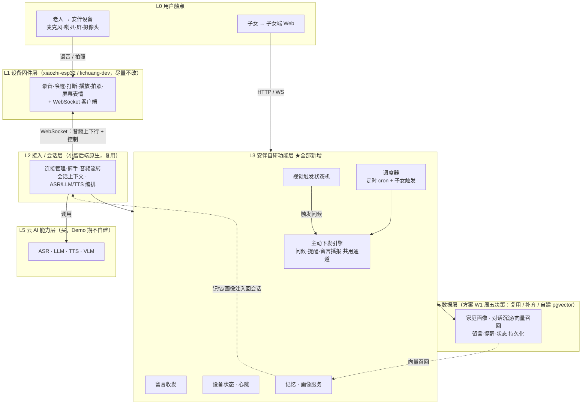
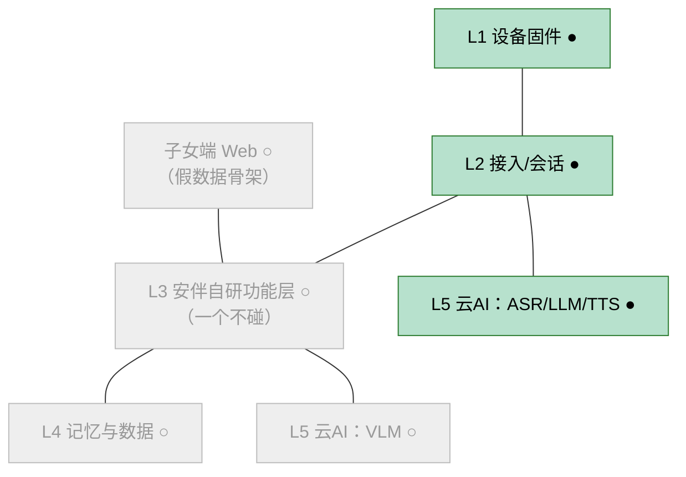
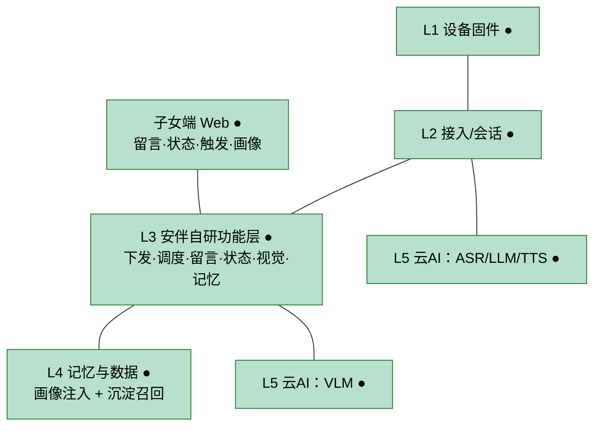
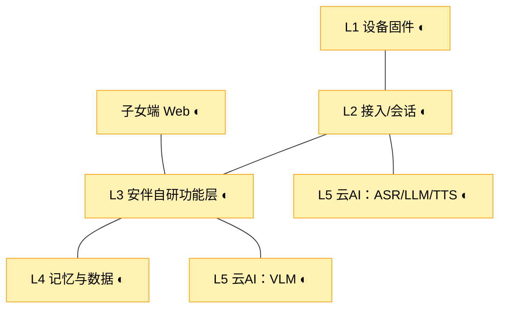
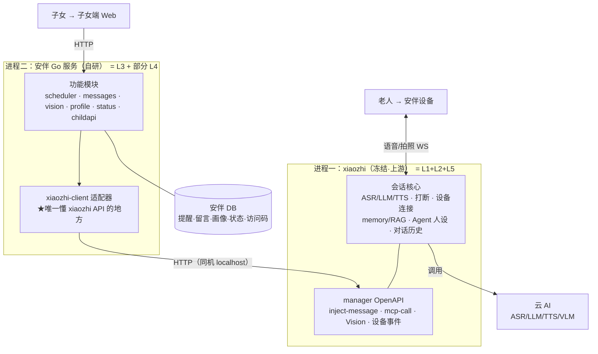

# 安伴 V0.1 架构图（分层 · 分模块 · 分阶段）

> 用途：用一组可渲染的 Mermaid 图，回答"三周到底要做出一个什么样的产品、它由哪些层/模块组成、每周点亮哪一块"。供评估架构合理性。
> 状态：草稿。确认满意后可并入 `安伴V0.1产品文档PRD.md` §4（现 §4 静态图保留为终态总图，本文两图作为分层 + 演进补充）。
> 起草：2026-05-28
>
> **如何看到图**：在 GitHub、VS Code（装 Markdown Preview Mermaid 插件）、Typora、Obsidian 等支持 Mermaid 的工具里打开本文件即可渲染。纯文本编辑器只能看到源码。

---

## 图一：分层 + 分模块 总架构（V0.1 终态）

自上而下 6 层。L1/L2 复用小智现成能力，**L3 安伴自研功能层是"灵魂"所在**，L5 全部买云 API。

---

## 图二：三周演进（同一套骨架逐周"点亮"）

三张图结构完全相同，只改颜色与状态标记，方便对照"产品每周长成什么样"。

**图例**：🟩 `●` 本周做到可用　🟨 `◐` 本周只加固/兜底（不加新模块）　⬜ `○` 尚未启动

### W1 基础闭环周 — 产品 = "一只能对话、能被打断的音箱"

> 守住的底线 = **48 小时闸门**保护的正好是 `L1 + L2 + L5a` 这条最底主链路；跑不通就降级后端，不碰上面任何一层。

### W2 安伴特色周 — 产品 = "会主动关心、子女能连接、记得事的陪伴设备"

> 最重的一周：L3 全开 + L4 上线 + L5b(VLM) 接入 + 子女端切真后端，**四块同时点亮**。

### W3 稳定兜底周 — 产品 = "台上 5 分钟不翻车的 Demo"

> **不加任何新模块**，给每一块套"连续 30min 不崩 / 断网重连 / 兜底视频 / 彩排"外壳。

---

## 图三：进程边界（C 方案——L3 是独立进程，跨边界调 L2）

图一/图二把 L3 画成"一层"；实际架构里 **L3 安伴自研功能层 = 一个独立 Go 进程**，通过 API 驱动一个基本冻结的 xiaozhi。详见 [服务端架构设计](./2026-05-28-server-architecture-design.md)。

> 三点：① 语音环全在 xiaozhi 内，安伴不碰；② 安伴所有对外调用收口到 `xiaozhi-client` 单点；③ 两套 DB 物理分开、互不复制真相源。

---

## 关键依赖与风险标注（评估要点）

对照图一的连线，4 条值得盯住：

| # | 架构事实 | 判断 | 处置 |
|---|---|---|---|
| ① | W1 只点亮 `L1+L2+L5a`，整层跳过 L3/L4 | ✅ 合理 | 分层切分与"先通主链路再加功能"纪律同一刀切；48h 闸门正好护住这条底链路 |
| ② | L3 `主动下发引擎` 是问候/提醒/留言播报的**共用通道**（图一中 SCHED/VIS 都汇入 PUSH） | ⚠️ DRY 但单点 | 它一挂，W2 三个特色一起哑。兜底=子女端按钮手动逐次触发（计划 §4）。**它是 W2 关键路径** |
| ③ | L3 `记忆·画像服务` 依赖 L4，而 **L4 方案 W1 周五才定** | ⚠️ 时序风险 | 已被 `decisions/` + 降级 4 级覆盖。注意：若走"自建 pgvector"(路线C)，L4 工作量会侵蚀 W2 的 L3 时间 |
| ④ | W2 同时点亮 L3 全部 + L4 + L5b + 子女端真连，其中**记忆(L4依赖)与视觉(L5b 新调)是两个高不确定性尖峰** | ⚠️ 负载尖峰 | 建议定规则："记忆和视觉谁先卡死谁先按降级表退，不并行死磕"。利好：视觉链路是**旁路**（VIS 只触发 PUSH，不嵌在 L2 主对话里），它崩不拖累对话 ✅ |
| ⑤ | ~~安伴靠假设的 xiaozhi API 驱动~~ | ✅ **已关闭（2026-05-29）** | 真代码深读已核实：走 manager 认证 OpenAPI（`/api/open/v1`，API Token），比假设更优；仍收口到 `xiaozhi-client` 单点。依据 [架构总览](./2026-05-29-xiaozhi-architecture-deep-dive.md) / [接缝级全景](./2026-05-29-xiaozhi-full-architecture-map.md) |

**整体结论**：架构合理，分层与执行纪律一致，无结构性问题。风险 ②③④ 为"已知风险 + 已有兜底"，⑤ 已据真代码核实**关闭**——非设计缺陷，仅需在路演时心里有数。

---

## 与其他文档的关系

- **PRD §4 系统架构**：现有静态终态图（设备↔后端↔云↔子女端）。本文图一是它的**分层细化版**，图二是它的**分阶段演进版**。
- **三周计划 §1 组件×周次矩阵**：文字工作表，讲"每周干哪些活"。本文图二讲"每周产品长成什么样"，二者互为表里——矩阵的 5 组件 ≈ 本文 L3 的 6 模块 + L4/L5b 的归属。
- **decisions/**：图一 L4 与风险 ③ 指向的记忆模块路线决策（W1 周五前定稿）。
